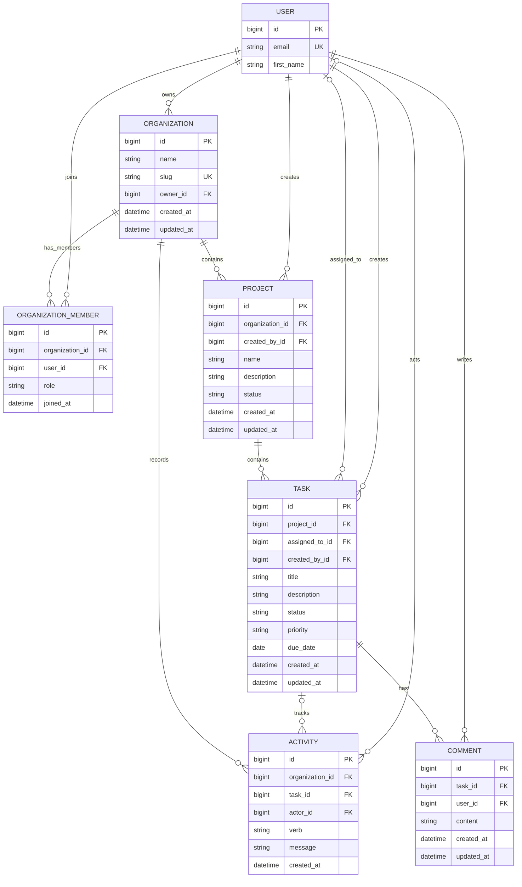

# Tasklane database schema

Tasklane uses PostgreSQL as its durable store. Django's `accounts.User` is the authentication principal. The model definitions are in `backend/apps/{accounts,organizations,projects,tasks}/models.py`.

## Entity relationships

`Activity.task_id` and `Activity.actor_id` are nullable: task history is removed with its task, while a deleted actor is retained as a null reference. `Task.assigned_to_id` is nullable and becomes null if the assignee is deleted. Created-by and organization-owner references use `PROTECT` so their source user cannot be removed while those records depend on it.

## Indexes and constraints

The models also receive normal primary-key indexes and Django's implicit indexes on foreign-key columns. Those support identity lookups and FK joins/deletes. The table below explains every explicitly declared non-trivial index or uniqueness constraint.

| Model | Index / constraint | Columns / predicate | Why it exists |
| --- | --- | --- | --- |
| `User` | Unique email constraint | `email` | Email is the login identifier; enforces case-normalized unique account identity and supports login lookup. |
| `Organization` | Unique slug constraint | `slug` | Prevents duplicate organization slugs and supports direct slug lookup. |
| `OrganizationMember` | `uniq_member_per_org` unique constraint | `(organization_id, user_id)` | Prevents duplicate membership/role rows and efficiently answers whether a user belongs to an organization. The leading organization column also supports listing its members. |
| `OrganizationMember` | `member_user_idx` | `(user_id)` | Supports the frequent reverse lookup of all organizations for a user and the membership-scoped tenant filters. |
| `Project` | `proj_org_status_idx` | `(organization_id, status, created_at DESC)` | Matches project list access patterns: one organization, optional active/archive status, newest first. |
| `Task` | `task_proj_status_idx` | `(project_id, status)` | Supports project Kanban boards and task status filtering within a project. |
| `Task` | `task_assignee_status_idx` | `(assigned_to_id, status)` | Supports an assignee's task list and status filtering, including the dashboard's “assigned to me” count. |
| `Task` | `task_open_due_idx` partial | `(due_date)` where `status != 'DONE'` | The overdue scan/dashboard only considers open tasks; omitting completed rows reduces index size and improves due-date scans. |
| `Comment` | `comment_task_idx` | `(task_id, created_at)` | Supports task-scoped retrieval and chronological ordering without scanning all comments. |
| `Activity` | `act_org_recent_idx` | `(organization_id, created_at DESC)` | Supports the organization activity feed, returned newest first. |
| `Activity` | `act_task_idx` | `(task_id, created_at)` | Supports the task-specific activity history. |

Foreign-key indexes not listed individually above are Django-generated single-column indexes on relationship fields, used for joins and referential operations. The compound and partial indexes above target measured access patterns rather than duplicating those FK indexes.

## Transaction and tenant notes

Membership is the tenant boundary. Projects belong to one organization; tasks belong to projects and derive their organization through that relationship. Comments and task activities inherit the tenant scope through the task/project relationship (activity also stores its organization directly for feed queries). Selectors must apply membership filtering before returning any tenant-owned rows. Project creation validates the requested organization through the role service before inserting; task creation uses a project already scoped to the caller.

Task mutations and activity writes are transactional. Assignment emails and notification publication are scheduled after commit so consumers do not observe rolled-back changes.
