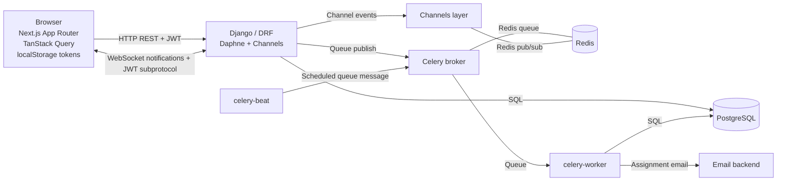
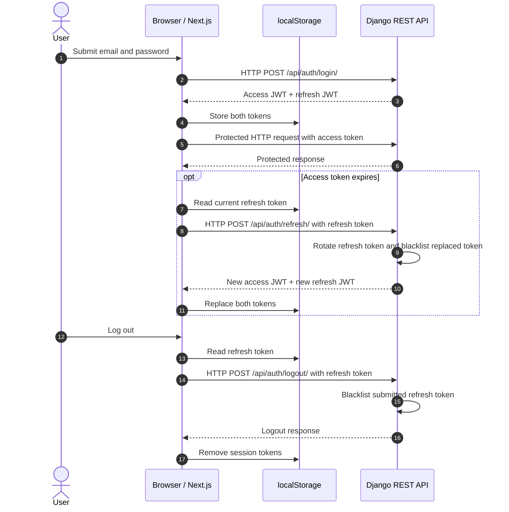
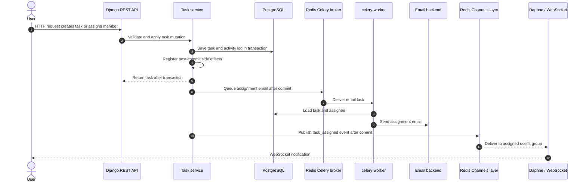

# Tasklane

Tasklane is a multi-tenant project and task management application built with Django REST Framework, PostgreSQL, Redis, Celery, Django Channels, and Next.js. The repository is organized as `backend/` and `frontend/`; Docker Compose runs the complete local stack.

## Architecture



HTTP REST and WebSocket traffic are served by the ASGI application. PostgreSQL stores durable domain data; Redis backs both the Celery broker and the Channels layer. The frontend is a Next.js App Router application with TypeScript, Tailwind CSS, and TanStack Query.

## Installation

The supported local installation path runs the complete stack with Docker Compose. It needs Docker Desktop or Docker Engine with the Compose plugin and Git.

### Docker setup

1. Create a local environment file and replace the example secrets:

   ```powershell
   Copy-Item .env.example .env
   ```

   `DJANGO_SECRET_KEY` is required and must contain at least 32 characters. Replace the example with a unique random value (50+ characters recommended), and set a strong PostgreSQL password. Do not commit `.env`.

2. Build and start all services in the background:

   ```powershell
   docker compose up --build -d
   ```

   Compose waits for PostgreSQL and Redis healthchecks before starting the API, Celery worker, or Beat. PostgreSQL health is checked with the configured `POSTGRES_USER` and `POSTGRES_DB`; Redis health is checked with `redis-cli ping`. The backend applies committed database migrations before starting the ASGI server.

   Check startup status with:

   ```powershell
   docker compose ps
   ```

   Wait until the database and Redis report `healthy` and the API, worker, Beat, and frontend report `running`.

3. Open:
   - Web app: <http://localhost:3000>
   - Interactive API reference (Swagger UI): <http://localhost:8000/api/docs/>
   - OpenAPI document: <http://localhost:8000/api/schema/>

Stop services with `docker compose down`. Database data is stored in the named `pgdata` volume and remains between restarts. To remove that data, explicitly run `docker compose down -v`.

### Environment configuration

`.env.example` documents the supported variables: PostgreSQL database/user/password/host, required `DJANGO_SECRET_KEY` (at least 32 characters), `DJANGO_DEBUG`, allowed hosts, Redis URL, JWT access/refresh lifetimes, email backend/from address, frontend URL, CORS origins, and the public frontend API URL. Local email defaults to Django's console backend. Use a real mail backend and tightly scoped host/CORS settings outside local development.

## Backend structure and API

Each domain app follows the same separation:

| App | Responsibility |
| --- | --- |
| `backend/apps/accounts/` | User model, registration, JWT endpoints, password changes and reset |
| `backend/apps/organizations/` | Organizations, memberships, roles, invitations and organization selectors |
| `backend/apps/projects/` | Project selectors, serializers and service-layer mutations |
| `backend/apps/tasks/` | Tasks, comments, activity history, selectors, services and Celery jobs |
| `backend/apps/notifications/` | JWT-authenticated WebSocket notifications and Redis channel-layer publishing |

Selectors own read/query behavior; services own business rules and writes; serializers define API input/output; views route requests and delegate. Authorization is centralized in `organizations.services.ensure_role` and `role_of`. Task activity is written in the task service layer rather than through model signals.

The REST API is rooted at `/api/`:

| Resource | Routes |
| --- | --- |
| Authentication | `/api/auth/register/`, `/api/auth/login/`, `/api/auth/refresh/`, `/api/auth/logout/`, `/api/auth/me/`, `/api/auth/password/change/`, `/api/auth/email/change/`, `/api/auth/password/forgot/`, `/api/auth/password/reset/` |
| Organizations | `/api/organizations/`, `/api/organizations/{id}/`, `/api/organizations/{id}/members/` (GET/POST), `/api/organizations/{id}/members/{member_id}/` (PATCH/DELETE), `/api/organizations/{id}/projects/` |
| Projects | `/api/projects/`, `/api/projects/{id}/` |
| Tasks | `/api/tasks/`, `/api/tasks/{id}/`, `/api/tasks/{id}/comments/`, `/api/tasks/{id}/activity/` |
| Comments | `/api/comments/{id}/` (PATCH/DELETE) |
| Dashboard/activity | `/api/dashboard/`, `/api/activity/` |

List endpoints support pagination and relevant search/order/filter options. Task filters can be combined, for example:

```text
GET /api/tasks/?status=TODO&priority=HIGH&assigned_to=42
```

Tasks can also be filtered by `project`; project lists support `status` and `organization`. Use `search` for configured text fields and `ordering` for fields allowed by that resource. List responses use page-number pagination with a default page size of 50.

### Authentication flow

- Registration and login accept JSON; login returns short-lived access and refresh JWTs.
- Protected HTTP requests send Authorization: Bearer <access-token>.
- Access tokens last 15 minutes by default; refresh tokens last 7 days by default. Both values are configurable.
- The frontend stores the tokens in browser `localStorage` and refreshes after a 401. Refresh rotation is enabled and the replaced refresh token is blacklisted.
- Logout blacklists the submitted refresh token. Password changes validate the new password with Django's configured validators, reject reusing the current password, blacklist all existing refresh tokens, and return a new token pair for the active session.
- Authenticated users can change their own password or email at `/api/auth/password/change/` and `/api/auth/email/change/`, regardless of organization role. Email changes require the current password, use case-insensitive uniqueness, and send a notice to the previous email address. `/api/auth/me/` only allows first-name edits.
- Login, register, refresh, logout, password change, email change, forgot-password, and reset-password endpoints use the `auth` throttle scope (10 requests/minute by default). Forgot-password responses do not reveal whether an email address exists.
- WebSocket authentication sends the access token as a `jwt.<token>` WebSocket subprotocol (alongside the `tasklane` protocol), not in the URL query string.



### Server vs Client Components

- Server route pages provide metadata and route shells: `frontend/app/(app)/dashboard/page.tsx`, `frontend/app/(app)/projects/[id]/page.tsx`, `frontend/app/(app)/tasks/[id]/page.tsx`, `frontend/app/(app)/settings/page.tsx`, `frontend/app/login/page.tsx`, and `frontend/app/register/page.tsx`.
- Interactive route components live beside their route pages: `frontend/app/(app)/dashboard/DashboardClient.tsx`, `frontend/app/(app)/projects/[id]/ProjectClient.tsx`, `frontend/app/(app)/tasks/[id]/TaskClient.tsx`, `frontend/app/(app)/settings/SettingsClient.tsx`, `frontend/app/login/LoginForm.tsx`, and `frontend/app/register/RegisterForm.tsx`.
- Interactive features stay client-side because authentication tokens are stored in `localStorage`, and the UI uses TanStack Query, browser APIs, forms, and drag-and-drop. Route pages do not fetch private API data on the server.
- Fetching private data in Server Components would require moving authentication tokens to secure `httpOnly` cookies. That is a documented future improvement; the current token storage and authentication model remain unchanged.
- The `(app)` route group has shared `loading.tsx`, client `error.tsx`, and `not-found.tsx` boundaries; dashboard, project, and task routes retain their more specific loading fallbacks.

### Permission architecture, tenant isolation, and security

Every list and detail selector scopes results through the authenticated user's organization membership. A resource outside that scope is not exposed by detail endpoints. `X-Organization-ID` is an optional context/filter header; it can narrow a membership-scoped result but never grants access. Mutations derive the organization from the database-backed project/task or validate organization membership and role before writing.

Roles are ordered `OWNER > ADMIN > MEMBER > VIEWER`. The API independently enforces these capabilities:

| Role | Capabilities |
| --- | --- |
| OWNER | Full organization administration; manage projects and members including admins; create tasks and comments; update and delete tasks; read organization data. The owner membership itself cannot be changed or removed. |
| ADMIN | Manage projects; invite, change, and remove MEMBER/VIEWER memberships; create tasks and comments; update and delete tasks; read organization data. Cannot manage OWNER or ADMIN memberships or grant ADMIN. |
| MEMBER | Read organization data; create tasks and comments; update tasks they created or are assigned to; edit/delete their own comments. Cannot manage members/projects or delete tasks. |
| VIEWER | Read organization data; cannot create tasks/comments, edit tasks/projects, or manage memberships. The API permits an author to edit/delete only their own existing comments, including after a role change. |

No role can change or remove their own membership. Comment authors can edit/delete their own comments; OWNER/ADMIN can moderate comment deletion. Account email and password changes are account-level operations available to any authenticated user, regardless of organization role. The frontend hides controls according to role, but authorization is enforced by the API.

Security notes: use a unique, at least 32-character `DJANGO_SECRET_KEY`; do not commit `.env`; restrict `ALLOWED_HOSTS` and CORS origins; use TLS and production-grade secret storage in deployment; keep authentication throttling enabled; and use HTTPS/WSS in production. `localStorage` tokens are readable by JavaScript, so protect the frontend against cross-site scripting and plan the documented `httpOnly` cookie migration.

### Organization invitations

Organization members are managed from the dashboard for the selected organization. OWNER and ADMIN can invite a registered account directly as MEMBER or VIEWER; only OWNER may invite or promote an ADMIN. An invitee who already has an account is added immediately. An unregistered email receives a seven-day pending invitation and a Celery-delivered registration link at `/register?invite=<token>`. Pending invitations are unique per organization and case-insensitive email.

Registration validates a supplied invitation token against the registering email. Registration without a token and successful login also accept active pending invitations for that email, so an invitee who opens the ordinary registration page or already has an account still joins the organization. Acceptance creates the membership with the invited role and marks the invitation used. Expired, unknown, email-mismatched, and already-used tokens are rejected. The resulting membership appears in that user's organization dropdown; role-based controls are hidden in the UI and remain protected by API authorization.

Member role changes and removals use `PATCH` and `DELETE` on `/api/organizations/{id}/members/{member_id}/`. These operations resolve the member inside the caller's organization, returning 404 for cross-organization IDs. The API schema documents their path IDs, JWT authentication, request body, success responses, and standard error envelope.

Errors use the shared response envelope:

```json
{
  "success": false,
  "error": {
    "code": "VALIDATION_ERROR",
    "message": "Validation failed.",
    "details": { "field": ["Reason"] }
  }
}
```

The details member is optional. Unexpected server errors use the same envelope and do not include stack traces. `/api/docs/` is generated from drf-spectacular and documents JWT auth, query/path/header parameters, request bodies, success responses, and the shared error envelope.

## Celery and real-time events

Redis serves as both the Celery broker and the Django Channels layer. Compose runs `celery-worker` and `celery-beat` separately from the API. Assignment email is queued only after the task transaction commits; the `send_assignment_email` worker task loads the task and sends mail through Django's configured email backend.



Celery Beat schedules `apps.tasks.jobs.flag_overdue_tasks` once per hour. The job selects tasks whose due date is before the local date, excludes `DONE` tasks, and checks `overdue_notified_at IS NULL`. It locks task rows in a transaction and rechecks the null condition in the update before setting the timestamp and writing one activity entry. Later runs skip already-marked tasks, preventing repeat flags and notifications. Overdue WebSocket notifications go to assigned users after commit; the overdue job does not send email.

The Channels consumer is exposed at `/ws/notifications/?organization_id=<id>`. It validates the JWT and organization membership at connection time, sends organization events only to organization members, sends assignment notifications only to the assigned user, and rechecks membership/token expiry before delivering an event. Notifications cover task assignment, new comments, and status changes. The frontend notification navbar reconnects as the session or active organization changes.

## Tests and linters

Run backend checks in the Compose environment from the repository root:

```powershell
docker compose exec backend pytest
docker compose exec backend ruff check .
docker compose exec backend black --check .
```

Install frontend dependencies and run checks from `frontend/` (the frontend Docker image uses Node.js 20):

```powershell
Set-Location frontend
npm ci
npm test
npm run lint
npm run build
```

Backend tests enforce a minimum 80% coverage threshold. `pytest.ini` supplies a test-only Django secret so tests can run without the local `.env`; it is never used by application startup. Frontend tests use Vitest, jsdom, and React Testing Library.

## Important technical decisions

- **Services instead of signals:** explicit task services own activity writes and transactional side effects. This keeps actor and old-value context available, makes transaction timing explicit, and avoids hidden signal behavior.
- **Why selectors:** selectors centralize tenant-scoped read/query behavior, reducing the chance that a view accidentally returns cross-organization data. Services separately own business rules and writes.
- **Token storage:** the current frontend stores JWTs in browser `localStorage`, matching the browser-only authentication helper and preserving the existing authentication model. This JavaScript-readable storage has XSS exposure and is not claimed to be ideal for production.
- **Future authentication improvement:** fetching private data in Server Components would require moving authentication to secure `httpOnly` cookies and addressing CSRF/session behavior. That change is not implemented.
- **Tenant boundaries:** tenant filtering is enforced in selectors, then write roles are checked in services. Client-supplied organization context is never an authorization grant.
- JWT refresh rotation and blacklist support provide revocation; auth endpoints are throttled.
- WebSocket credentials travel in a subprotocol rather than query parameters; Redis Channels supports multiple ASGI instances.
- PostgreSQL stores durable data; Redis is intentionally used for transient queues/events rather than domain records.

## Production scaling

- To scale, run multiple stateless ASGI/API instances behind a proxy with WebSocket support, scale Celery workers separately from Beat (keep one Beat scheduler per environment), and use managed PostgreSQL/Redis with backups, monitoring, and connection limits. Configure trusted origins/hosts, TLS, secrets, email delivery, and database migrations as part of production operations.
- See [DATABASE_SCHEMA.md](./DATABASE_SCHEMA.md) for the ER diagram and rationale for explicit and uniqueness indexes.

## Screenshots

No screenshots are included yet. Add reviewed application captures under [`docs/screenshots/`](./docs/screenshots/) when available:

- `docs/screenshots/` — placeholder for future screenshots; no images are currently provided.

## Known limitations and next steps

- Docker Compose is the local development stack, not a production high-availability deployment. Production ingress, TLS termination, managed-service provisioning, backups, monitoring, and secret rotation must be configured separately.
- JWTs remain in browser `localStorage`; secure `httpOnly` cookie authentication is a future improvement and is required before using Server Components to fetch private API data.
- The default email backend writes messages to the console. Configure and test a production email backend before relying on assignment mail delivery.
- No screenshots are checked in; the placeholder folder is intentionally empty.
