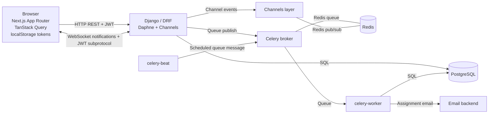
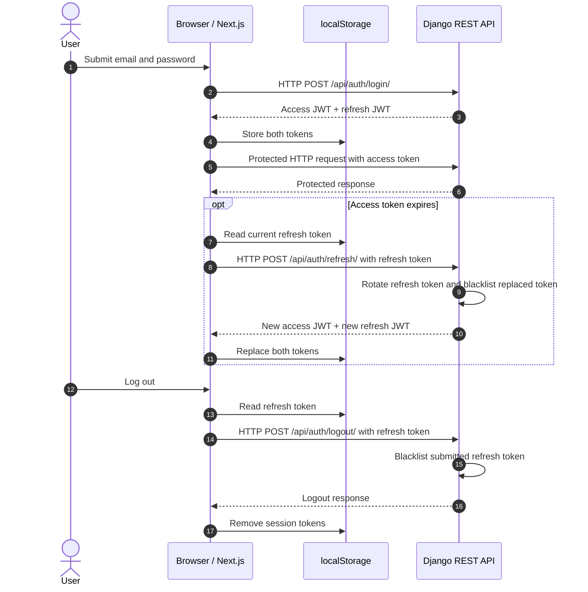
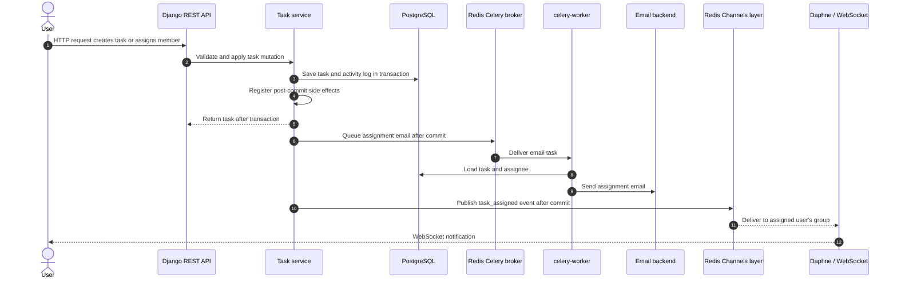
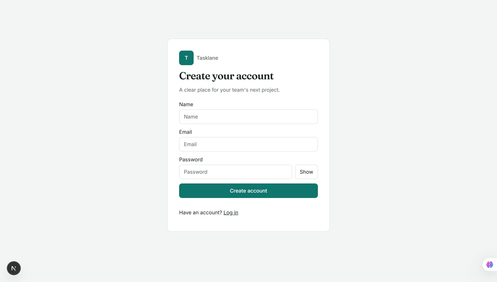
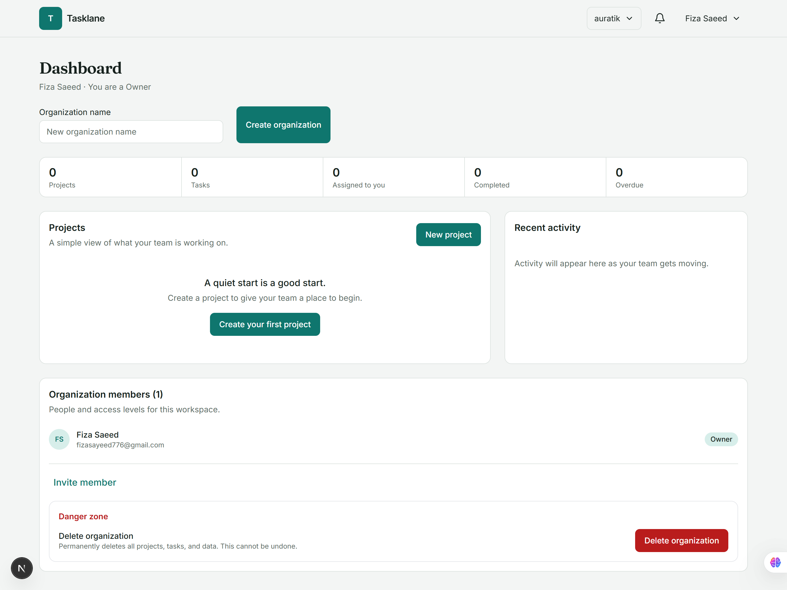
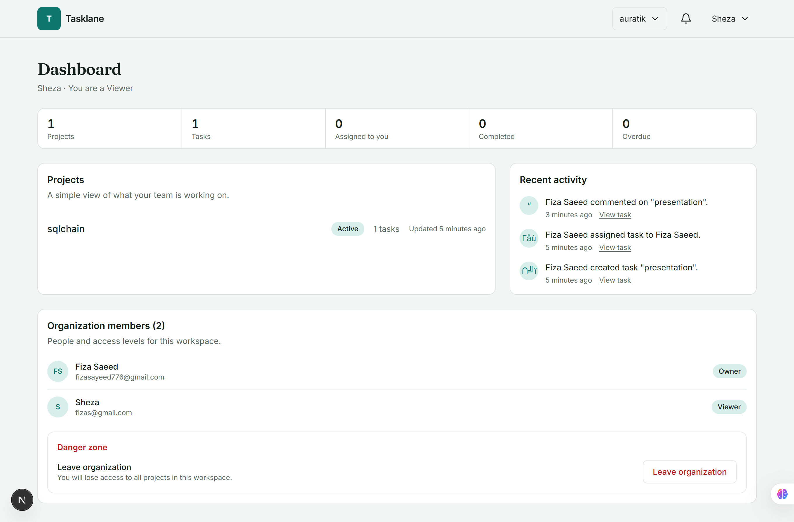
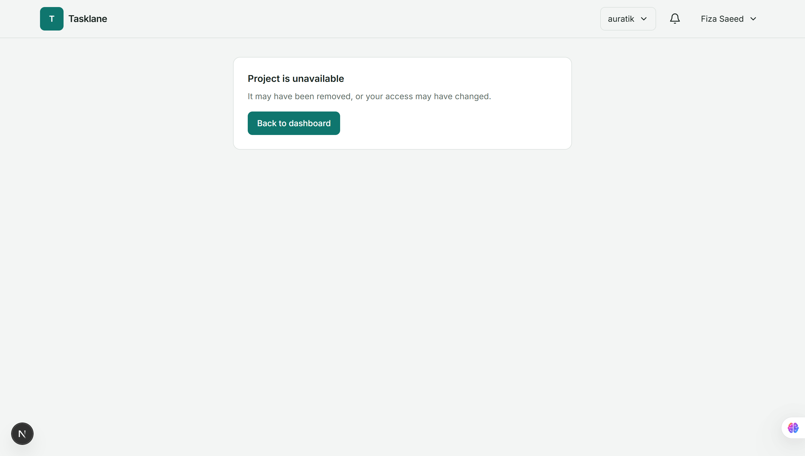
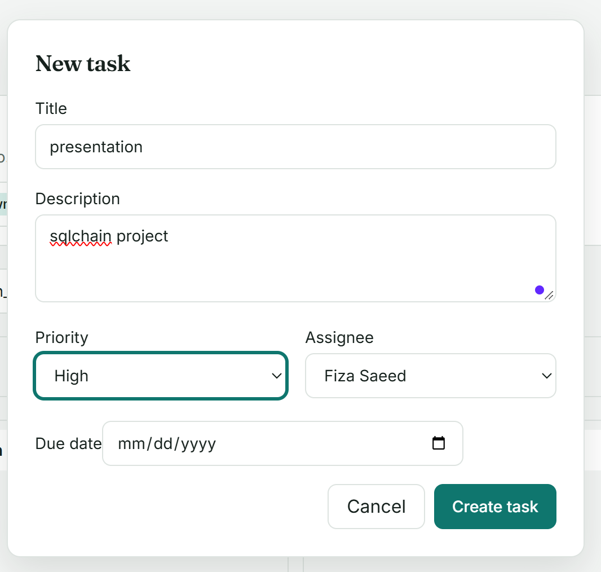
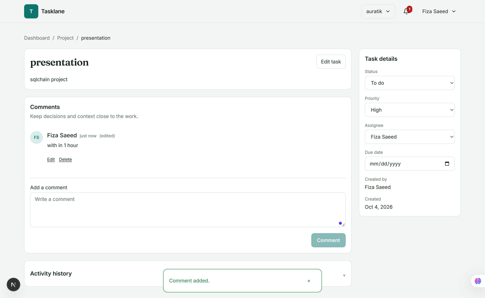
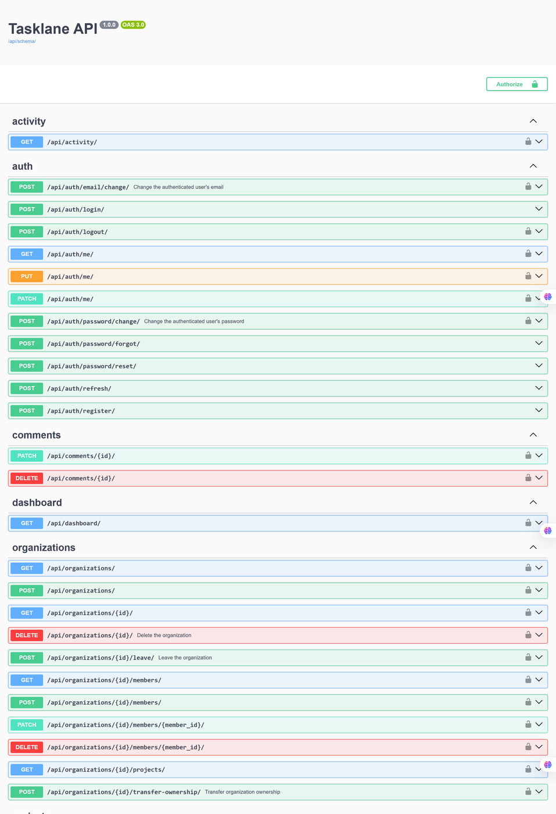

# Tasklane

Tasklane is a multi-tenant project and task management application built with Django REST Framework, PostgreSQL, Redis, Celery, Django Channels, and Next.js. The repository is organized as `backend/` and `frontend/`; Docker Compose runs the complete local stack.

## Architecture



HTTP REST and WebSocket traffic are served by the ASGI application. PostgreSQL stores durable domain data; Redis backs both the Celery broker and the Channels layer. The frontend is a Next.js App Router application with TypeScript, Tailwind CSS, and TanStack Query.

## Installation

The supported local installation path runs the complete stack with Docker Compose. It needs Docker Desktop or Docker Engine with the Compose plugin and Git.

### Quick start

1. Clone the repository and change into its folder:

   ```sh
   git clone https://github.com/fizasayeed776/tasklane-project.git
   cd tasklane-project
   ```

2. Copy the example environment file:

   ```sh
   cp .env.example .env
   ```

   On Windows PowerShell, use `Copy-Item .env.example .env`.

3. Generate a unique `DJANGO_SECRET_KEY` and write it into `.env` **before the first start**. The default placeholder is deliberately rejected when `DJANGO_DEBUG=0`; the key must be at least 50 characters and must not contain placeholder text. These commands update `.env` without printing the generated key.

   **Windows PowerShell** (run from the repository folder):

   ```powershell
   $path = Join-Path (Get-Location).Path ".env"
   $bytes = New-Object byte[] 48
   [Security.Cryptography.RandomNumberGenerator]::Create().GetBytes($bytes)
   $key = [Convert]::ToBase64String($bytes).Replace('+','-').Replace('/','_').TrimEnd('=')
   $text = [IO.File]::ReadAllText($path)
   $text = [regex]::Replace($text, '(?m)^DJANGO_SECRET_KEY=[^\r\n]*', "DJANGO_SECRET_KEY=$key")
   [IO.File]::WriteAllText($path, $text, (New-Object Text.UTF8Encoding($false)))
   (Select-String -Path $path -Pattern "^DJANGO_SECRET_KEY=").Line -match "replace-me"
   ```

   The last line should print `False`. Run this block from the repository folder; `$path` resolves to the full path of that folder's `.env`.

   **Linux/macOS**:

   ```sh
   key=$(openssl rand -base64 48 | tr '+/' '-_' | tr -d '=\n')
   if sed --version >/dev/null 2>&1; then
     sed -i "s|^DJANGO_SECRET_KEY=.*|DJANGO_SECRET_KEY=$key|" .env
   else
     sed -i '' "s|^DJANGO_SECRET_KEY=.*|DJANGO_SECRET_KEY=$key|" .env
   fi
   unset key
   grep -c replace-me .env
   ```

   The `sed` branch handles GNU sed and macOS/BSD sed. The final check should print `0`.

4. Build and start the services:

   ```sh
   docker compose up --build
   ```

   Compose builds the frontend as a Next.js production image (`next build` during image creation and `next start` at runtime). It waits for PostgreSQL and Redis healthchecks before starting the API, Celery worker, or Beat. The backend applies committed database migrations and collects static assets before starting the ASGI server. In another terminal, use `docker compose ps` to check that the database and Redis are healthy and the API, worker, Beat, and frontend are running. Swagger UI assets are served locally rather than loaded from a CDN.

   `NEXT_PUBLIC_API_URL` is embedded in the frontend image at build time and configures browser REST requests and the notifications WebSocket URL. Rebuild with `docker compose up --build` after changing frontend settings.

5. Optionally load demo data:

   ```sh
   docker compose exec backend python manage.py seed_demo --force
   ```

   This creates a demo organization and these accounts (password `DemoPass!234`):

   | Role | Email | Password |
   | --- | --- | --- |
   | Owner | `owner@demo.test` | `DemoPass!234` |
   | Admin | `admin@demo.test` | `DemoPass!234` |
   | Member | `member@demo.test` | `DemoPass!234` |
   | Viewer | `viewer@demo.test` | `DemoPass!234` |
   | Outsider | `outsider@demo.test` | `DemoPass!234` |

   `--force` allows seeding when `DJANGO_DEBUG=0`; use it only for local/demo environments, never on a real production database.

6. Open the application and API reference:
   - Frontend: <http://localhost:3000>
   - Swagger UI: <http://localhost:8000/api/docs/>
   - OpenAPI document: <http://localhost:8000/api/schema/>

Stop services with `docker compose down`. Database data is stored in the named `pgdata` volume and remains between restarts. To remove that data, explicitly run `docker compose down -v`.

### Environment configuration

`.env.example` documents the supported variables: PostgreSQL database/user/password/host, required `DJANGO_SECRET_KEY` (at least 50 characters without placeholder text outside debug mode), `DJANGO_DEBUG`, allowed hosts, Redis URL, JWT access/refresh lifetimes, email backend/from address, frontend URL, CORS origins, and the public frontend API URL. Local email defaults to Django's console backend. Use a real mail backend and tightly scoped host/CORS settings outside local development.

### Troubleshooting

- **Services exit right after start:** run `docker compose ps -a` and `docker compose logs --tail 30 backend`. Django may report that `DJANGO_SECRET_KEY` contains a placeholder, is shorter than 50 characters, or is not set. Replace the value in `.env` with a newly generated key using Quick start step 3, then run `docker compose up --build` again. The PowerShell block must be run from the repository folder.
- **“429 Too many requests”:** clear the development throttle counters with `docker compose exec redis redis-cli -n 1 flushdb`.
- **Inviting people:** someone without an account must register through the invite link; the owner can use the **Copy invite link** button. Someone who already has an account is added directly. A person who registers without using the invite link gets their own organization instead.
- **Frontend changes do not appear:** the frontend is a production image, so rebuild it with `docker compose up --build`.

### Before deploying to a real server

- Replace `DJANGO_SECRET_KEY` with a unique, securely stored key and change `POSTGRES_PASSWORD`.
- Set `ALLOWED_HOSTS` to the real hostnames and keep `DJANGO_DEBUG=0`.
- Configure SMTP for real email delivery (Mailpit is suitable for testing only).
- Set `FRONTEND_URL` and `NEXT_PUBLIC_API_URL` to the deployed URLs.
- Serve traffic over HTTPS behind a reverse proxy; configure `NUM_PROXIES` and `X-Forwarded-For` handling for the real client IP.
- Never commit `.env`.

### Backend dependencies

The backend uses Django 5.2, a long-term support (LTS) release. `backend/requirements.txt` contains runtime dependencies only. `backend/requirements-dev.txt` includes those runtime dependencies plus pytest, coverage, lint, and formatting tools. Docker Compose builds the backend, Celery worker, and Celery Beat with `INSTALL_DEV=true` by default so development and verification tools are available in each service container. Set the Docker build argument `INSTALL_DEV=false` when building a runtime-only image; the Dockerfile then installs only `requirements.txt`.

## Backend structure and API

Each domain app follows the same separation:

| App | Responsibility |
| --- | --- |
| `backend/apps/accounts/` | User model, registration, JWT endpoints, password changes and reset, account permissions |
| `backend/apps/organizations/` | Organizations, memberships, roles, invitations, selectors and role permissions |
| `backend/apps/projects/` | Project selectors, serializers, role permissions and service-layer mutations |
| `backend/apps/tasks/` | Tasks, comments, activity history, selectors, role permissions, services and Celery jobs |
| `backend/apps/notifications/` | JWT-authenticated WebSocket notifications and Redis channel-layer publishing |

Selectors own read/query behavior; services own business rules and writes; serializers define API input/output; DRF permission classes in each core app enforce request and object access, and views route requests and delegate. Organization-scoped permission classes use the central `organizations.services.ensure_role` helper, while `organizations.selectors.role_of` supplies membership-role lookups; service-layer checks remain as defense in depth for non-HTTP callers. Task activity is written in the task service layer rather than through model signals.

The REST API is rooted at `/api/`:

| Resource | Routes |
| --- | --- |
| Authentication | `/api/auth/register/`, `/api/auth/login/`, `/api/auth/refresh/`, `/api/auth/logout/`, `/api/auth/me/`, `/api/auth/password/change/`, `/api/auth/email/change/`, `/api/auth/password/forgot/`, `/api/auth/password/reset/` |
| Organizations | `/api/organizations/`, `/api/organizations/{id}/` (GET/DELETE), `/api/organizations/{id}/members/` (GET/POST), `/api/organizations/{id}/members/{member_id}/` (PATCH/DELETE), `/api/organizations/{id}/projects/`, `/api/organizations/{id}/transfer-ownership/` (POST), `/api/organizations/{id}/leave/` (POST) |
| Projects | `/api/projects/`, `/api/projects/{id}/` |
| Tasks | `/api/tasks/`, `/api/tasks/{id}/`, `/api/tasks/{id}/comments/`, `/api/tasks/{id}/activity/` |
| Comments | `/api/comments/{id}/` (PATCH/DELETE) |
| Dashboard/activity | `/api/dashboard/`, `/api/activity/` |

List endpoints support pagination and relevant search/order/filter options. Task filters can be combined, for example:

```text
GET /api/tasks/?status=TODO&priority=HIGH&assigned_to=42
```

Tasks can also be filtered by `project`; project lists support `status` and `organization`. Use `search` for configured text fields and `ordering` for fields allowed by that resource. List responses use page-number pagination with a default page size of 50.

### Authentication flow

- Registration and login accept JSON; login returns short-lived access and refresh JWTs.
- Protected HTTP requests send Authorization: Bearer <access-token>.
- Access tokens last 15 minutes by default; refresh tokens last 7 days by default. Both values are configurable.
- The frontend stores the tokens in browser `localStorage` and refreshes after a 401. Refresh rotation is enabled and the replaced refresh token is blacklisted.
- Logout blacklists the submitted refresh token. Password changes validate the new password with Django's configured validators, reject reusing the current password, blacklist all existing refresh tokens, and return a new token pair for the active session.
- Authenticated users can change their own password or email at `/api/auth/password/change/` and `/api/auth/email/change/`, regardless of organization role. Email changes require the current password, use case-insensitive uniqueness, and send a notice to the previous email address. `/api/auth/me/` only allows first-name edits.
- Account emails are stripped and lowercased on registration and email changes. Login and password-reset lookup accept different casing, and a database constraint prevents duplicate accounts regardless of email casing.
- Login, register, refresh, logout, password change, email change, forgot-password, and reset-password endpoints use the `auth` throttle scope (10 requests/minute by default). Forgot-password responses do not reveal whether an email address exists.
- WebSocket authentication sends the access token as a `jwt.<token>` WebSocket subprotocol (alongside the `tasklane` protocol), not in the URL query string.



### Server vs Client Components

- Server route pages provide metadata and route shells: `frontend/app/(app)/dashboard/page.tsx`, `frontend/app/(app)/projects/[id]/page.tsx`, `frontend/app/(app)/tasks/[id]/page.tsx`, `frontend/app/(app)/settings/page.tsx`, `frontend/app/login/page.tsx`, and `frontend/app/register/page.tsx`.
- Interactive route components live beside their route pages: `frontend/app/(app)/dashboard/DashboardClient.tsx`, `frontend/app/(app)/projects/[id]/ProjectClient.tsx`, `frontend/app/(app)/tasks/[id]/TaskClient.tsx`, `frontend/app/(app)/settings/SettingsClient.tsx`, `frontend/app/login/LoginForm.tsx`, and `frontend/app/register/RegisterForm.tsx`.
- Interactive features stay client-side because authentication tokens are stored in `localStorage`, and the UI uses TanStack Query, browser APIs, forms, and drag-and-drop. Route pages do not fetch private API data on the server.
- Fetching private data in Server Components would require moving authentication tokens to secure `httpOnly` cookies. That is a documented future improvement; the current token storage and authentication model remain unchanged.
- The `(app)` route group has shared `loading.tsx`, client `error.tsx`, and `not-found.tsx` boundaries; dashboard, project, and task routes retain their more specific loading fallbacks.

### Permission architecture, tenant isolation, and security

Every list and detail selector scopes results through the authenticated user's organization membership. A resource outside that scope is not exposed by detail endpoints. `X-Organization-ID` is an optional context/filter header; it can narrow a membership-scoped result but never grants access. Mutations derive the organization from the database-backed project/task or validate organization membership and role before writing.

Roles are ordered `OWNER > ADMIN > MEMBER > VIEWER`. The API independently enforces these capabilities:

| Role | Capabilities |
| --- | --- |
| OWNER | Full organization administration; manage projects and members including admins; create tasks and comments; update and delete tasks; read organization data. The owner membership itself cannot be changed or removed via the normal member endpoints. OWNER may transfer ownership to another member (they become OWNER, the former owner becomes ADMIN), and may delete the organization with a name-confirmation body. |
| ADMIN | Manage projects; invite, change, and remove MEMBER/VIEWER memberships; create tasks and comments; update and delete tasks; read organization data. Cannot manage OWNER or ADMIN memberships or grant ADMIN. May leave the organization. |
| MEMBER | Read organization data; create tasks and comments; update tasks they created or are assigned to; edit/delete their own comments. Cannot manage members/projects or delete tasks. May leave the organization. |
| VIEWER | Read organization data; cannot create tasks/comments, edit tasks/projects, or manage memberships. The API permits an author to edit/delete only their own existing comments, including after a role change. May leave the organization. |

No role can change or remove their own membership. Comment authors can edit/delete their own comments; OWNER/ADMIN can moderate comment deletion. Account email and password changes are account-level operations available to any authenticated user, regardless of organization role. The frontend hides controls according to role, but authorization is enforced by the API.

Security notes: use a unique `DJANGO_SECRET_KEY` of at least 50 characters without placeholder text outside debug mode; do not commit `.env`; restrict `ALLOWED_HOSTS` and CORS origins; use TLS and production-grade secret storage in deployment; keep authentication throttling enabled; and use HTTPS/WSS in production. `localStorage` tokens are readable by JavaScript, so protect the frontend against cross-site scripting and plan the documented `httpOnly` cookie migration.

### Rate limiting

Every unauthenticated auth endpoint has its own throttle scope so that a burst on one path (e.g. many token refreshes) cannot lock users out of another (e.g. login). Authenticated account-mutation endpoints share a separate scope.

| Scope | Endpoints | Default | Environment variable |
| --- | --- | --- | --- |
| `auth_login` | `POST /api/auth/login/` | 10/min | `THROTTLE_LOGIN` |
| `auth_register` | `POST /api/auth/register/` | 10/min | `THROTTLE_REGISTER` |
| `auth_refresh` | `POST /api/auth/refresh/` | 60/min | `THROTTLE_REFRESH` |
| `auth_password` | `POST /api/auth/password/forgot/`, `POST /api/auth/password/reset/` | 5/min | `THROTTLE_PASSWORD` |
| `auth_account` | `POST /api/auth/password/change/`, `POST /api/auth/email/change/`, `POST /api/auth/logout/` | 10/min | `THROTTLE_ACCOUNT` |

All limits are per IP address. A 429 response uses the standard error envelope with `"code": "THROTTLED"` and a `Retry-After` header.

**Shared counters:** throttle counters are stored in Redis database 1 (derived from `REDIS_URL` by replacing the database path with `/1`) so all ASGI worker processes share the same counts and a single process restart does not reset them. Reset counters in development with:

```powershell
docker compose exec redis redis-cli -n 1 flushdb
```

**Reverse proxy:** if the application runs behind a load balancer or reverse proxy, configure `NUM_PROXIES` in Django settings so throttle limits apply against the real client IP from `X-Forwarded-For` rather than the proxy address. Without this, all users behind the same proxy share one counter.

### Organization invitations

Organization members are managed from the dashboard for the selected organization. OWNER and ADMIN can invite a registered account directly as MEMBER or VIEWER; only OWNER may invite or promote an ADMIN. An invitee who already has an account is added immediately. An unregistered email receives a seven-day pending invitation and a Celery-delivered registration link at `/register?invite=<token>`. Pending invitations are unique per organization and case-insensitive email.

Registration validates a supplied invitation token against the registering email case-insensitively. An invitation is accepted only by registering through the emailed `/register?invite=<token>` link with the invited email. Registering or logging in without the token never joins an organization, because email ownership is not otherwise verified. Acceptance creates the membership with the invited role and marks the invitation used. Expired, unknown, email-mismatched, and already-used tokens are rejected. The resulting membership appears in that user's organization dropdown; role-based controls are hidden in the UI and remain protected by API authorization.

Member role changes and removals use `PATCH` and `DELETE` on `/api/organizations/{id}/members/{member_id}/`. These operations resolve the member inside the caller's organization, returning 404 for cross-organization IDs. The API schema documents their path IDs, JWT authentication, request body, success responses, and standard error envelope.

### Ownership management

Three additional organization-lifecycle endpoints enforce the OWNER invariant — every organization always has exactly one OWNER at all times.

**Transfer ownership** — `POST /api/organizations/{id}/transfer-ownership/` with `{"member_id": <id>}`. Only the current OWNER may call this. The target must be an existing member of the same organization (pending invitations and cross-organization IDs return 404). In a single atomic transaction the target becomes OWNER, the caller is demoted to ADMIN, and `Organization.owner` is updated. An activity entry with verb `ownership_transferred` is written. Non-owners receive 403; non-members receive 404.

**Leave organization** — `POST /api/organizations/{id}/leave/`. Any member with role ADMIN, MEMBER, or VIEWER may leave. The OWNER must transfer ownership first; calling leave as OWNER returns 400 with a message explaining the requirement. On success the membership row is deleted and any tasks assigned to the leaving user within that organization are unassigned (`assigned_to` set to null). The operation is silent to other members; no activity entry is written.

**Delete organization** — `DELETE /api/organizations/{id}/` with `{"name": "<exact organization name>"}`. Only the OWNER may call this. The body must contain the organization name exactly as stored (case-sensitive); a mismatch returns 400. A successful delete cascades all related data in one transaction: projects, tasks, comments, activity entries, pending invitations, and all memberships. No orphaned records remain. Non-owners receive 403; non-members receive 404.

The dashboard members section and the account settings page both surface these operations with confirmation dialogs: transfer ownership names the new owner; leave shows an unassignment warning; delete requires typing the organization name and keeps the confirm button disabled until the input matches.

Errors use the shared response envelope:

```json
{
  "success": false,
  "error": {
    "code": "VALIDATION_ERROR",
    "message": "Validation failed.",
    "details": { "field": ["Reason"] }
  }
}
```

The details member is optional. Unexpected server errors use the same envelope and do not include stack traces. `/api/docs/` is generated from drf-spectacular and documents JWT auth, query/path/header parameters, request bodies, success responses, and the shared error envelope.

## Celery and real-time events

Redis serves as both the Celery broker and the Django Channels layer. Compose runs `celery-worker` and `celery-beat` separately from the API. Assignment email is queued only after the task transaction commits; the `send_assignment_email` worker task loads the task and sends mail through Django's configured email backend.



Celery Beat schedules `apps.tasks.jobs.flag_overdue_tasks` once per hour. The job selects tasks whose due date is before the local date, excludes `DONE` tasks, and checks `overdue_notified_at IS NULL`. It locks task rows in a transaction and rechecks the null condition in the update before setting the timestamp and writing one activity entry. Later runs skip already-marked tasks, preventing repeat flags and notifications. Overdue WebSocket notifications go to assigned users after commit; the overdue job does not send email.

The Channels consumer is exposed at `/ws/notifications/?organization_id=<id>`. It validates the JWT and organization membership at connection time, sends organization events only to organization members, sends assignment notifications only to the assigned user, and rechecks membership/token expiry before delivering an event. Notifications cover task assignment, new comments, and status changes. The frontend notification navbar reconnects as the session or active organization changes.

## Demo data and housekeeping

### Seed demo data

Populate a local environment with a complete demo organization, users, projects, tasks, comments, and activity entries generated through the same service layer used in production:

```powershell
docker compose exec backend python manage.py seed_demo
```

This creates the following accounts (password `DemoPass!234`):

| Email | Display name | Role in Demo Org |
| --- | --- | --- |
| `owner@demo.test` | Demo Owner | Owner |
| `admin@demo.test` | Demo Admin | Admin |
| `member@demo.test` | Demo Member | Member |
| `viewer@demo.test` | Demo Viewer | Viewer |
| `outsider@demo.test` | Demo Outsider | Owner of Other Org (not in Demo Org) |

Use `--password <value>` to change the password. Use `--force` to run against a non-debug environment (not recommended in production). The command is idempotent: running it twice does not create duplicates.

### Housekeeping: prune stale data

Remove accepted or expired `PendingInvitation` rows that are older than 30 days. Default is a **dry run** — nothing is deleted unless `--yes` is provided:

```powershell
# Show what would be deleted (dry run)
docker compose exec backend python manage.py prune_stale_data

# Delete stale invitations
docker compose exec backend python manage.py prune_stale_data --yes

# Also delete eligible orphaned user accounts
docker compose exec backend python manage.py prune_stale_data --yes --users
```

The `--users` flag additionally lists or deletes accounts that have no organization membership, were created more than `--days` days ago (default 30), are not staff or superusers, and have not authored any task, comment, or activity entry. It never deletes a user who owns an organization, created a task, sent an invitation, or would cascade into other people's data.

> **Note:** User accounts are **never deleted automatically** (no signals, no scheduled job). Users may belong to zero organizations legitimately — for example, an account that was created but not yet added to any workspace. Automatic deletion is opt-in only through `prune_stale_data --yes --users`. Accepted and expired `PendingInvitation` rows are pruned daily by the `prune-stale-invitations` Celery Beat task (they are not domain data and do not cascade into user records).

## Email setup

### Console mode (default)

By default all outgoing email is printed to the Docker log instead of being delivered. This is convenient for local development — you can read invitation links and password-reset links with:

```powershell
docker compose logs backend | Select-String "register\?invite"
```

### Real SMTP

Set the following variables in `.env` (see `.env.example` for a Gmail app-password example):

```env
EMAIL_BACKEND=django.core.mail.backends.smtp.EmailBackend
EMAIL_HOST=smtp.gmail.com
EMAIL_PORT=587
EMAIL_HOST_USER=youraddress@gmail.com
EMAIL_HOST_PASSWORD=your-16-char-app-password
EMAIL_USE_TLS=1
```

`EMAIL_HOST_PASSWORD` is never logged or included in error responses. Restart the backend after changing `.env`:

```powershell
docker compose up --build -d
```

### Optional: Mailpit local mail-catcher

Mailpit captures outgoing email and provides a web UI. It requires no account and shows rendered HTML email. Start it with the `dev-mail` Docker Compose profile:

```powershell
docker compose --profile dev-mail up -d
```

Then add to `.env`:

```env
EMAIL_HOST=mailpit
EMAIL_PORT=1025
EMAIL_USE_TLS=0
```

Open <http://localhost:8025> to browse captured emails. The normal `docker compose up --build` is **unchanged** — Mailpit only starts when the profile is explicitly requested.

### Invitation flow

When an OWNER or ADMIN invites an unregistered email address, Tasklane:

1. Creates a single-use `PendingInvitation` with a random token valid for seven days.
2. Queues a Celery task that emails the link `{FRONTEND_URL}/register?invite=<token>` to the invited address. If delivery fails the task retries up to three times with exponential backoff.
3. Returns `invite_url` and `expires_at` in the API response so the inviter can copy and share the link manually using the **Copy invite link** button on the dashboard.

**The invite link is the only way an unregistered email address joins an organization.** Registering or logging in without the link never grants organization membership, because email ownership is not otherwise verified.

When the invited person clicks the link and completes registration, the invitation is marked used, a membership row is created with the invited role, and the browser is taken directly to the invited organization's dashboard.

## Tests and linters

Run backend checks in the Compose environment from the repository root:

```powershell
docker compose exec backend pytest
docker compose exec backend ruff check .
docker compose exec backend black --check .
docker compose exec backend python manage.py makemigrations --check --dry-run
docker compose exec backend python manage.py spectacular --validate
```

Install frontend dependencies and run checks from `frontend/` (the frontend Docker image uses Node.js 20):

```powershell
Set-Location frontend
npm ci
npm test
npm run lint
npm run format
npm run format:check
npm run build
```

Backend tests enforce a minimum 80% coverage threshold. `pytest.ini` supplies a test-only Django secret so tests can run without the local `.env`; it is never used by application startup. Frontend tests use Vitest, jsdom, and React Testing Library.

## Important technical decisions

- **Services instead of signals:** explicit task services own activity writes and transactional side effects. This keeps actor and old-value context available, makes transaction timing explicit, and avoids hidden signal behavior.
- **Why selectors:** selectors centralize tenant-scoped read/query behavior, reducing the chance that a view accidentally returns cross-organization data. Services separately own business rules and writes.
- **Ownership invariant:** transfer, leave, and delete are each implemented as atomic transactions so every organization always has exactly one OWNER record. The `Organization.owner` FK and the `OrganizationMember.role == OWNER` row are updated together inside `transfer_ownership`; the normal member PATCH/DELETE endpoints still block role changes to/from OWNER so neither path can accidentally create a second OWNER or leave an organization ownerless.
- **Delete uses a name-confirmation body:** `DELETE /api/organizations/{id}/` requires `{"name": "<org name>"}` to prevent accidental cascade deletion through scripting or browser bugs. The API validates the name server-side so the frontend confirmation dialog is defense-in-depth, not the only gate.
- **Token storage:** the current frontend stores JWTs in browser `localStorage`, matching the browser-only authentication helper and preserving the existing authentication model. This JavaScript-readable storage has XSS exposure and is not claimed to be ideal for production.
- **Future authentication improvement:** fetching private data in Server Components would require moving authentication to secure `httpOnly` cookies and addressing CSRF/session behavior. That change is not implemented.
- **Tenant boundaries:** tenant filtering is enforced in selectors, then write roles are checked in services. Client-supplied organization context is never an authorization grant.
- JWT refresh rotation and blacklist support provide revocation; auth endpoints are throttled.
- WebSocket credentials travel in a subprotocol rather than query parameters; Redis Channels supports multiple ASGI instances.
- PostgreSQL stores durable data; Redis is intentionally used for transient queues/events rather than domain records.

## Production scaling

- Run multiple stateless ASGI/API instances behind a load balancer with WebSocket support, and scale Celery workers horizontally according to queue depth while running one Beat scheduler per environment. Use managed PostgreSQL with appropriate indexes, connection pooling, backups and read replicas for read-heavy traffic; keep Redis as the shared Celery broker and Channels layer. Add a shared cache for frequently read data, retain pagination and tenant-scoped queries, and tune API/auth rate limits at the application and edge. Configure trusted origins/hosts, TLS, secret rotation, email delivery, observability and backward-compatible database migrations as part of production operations.
- See [DATABASE_SCHEMA.md](./DATABASE_SCHEMA.md) for the ER diagram and rationale for explicit and uniqueness indexes.

## Screenshots

### Registration



### Dashboard — stats, projects, recent activity, and organization management



### Viewer role — dashboard with member list and role badges



### Project board — Kanban view with task filters



### New task modal



### Task detail — comments and activity history



### REST API — Swagger UI endpoint list



### Demo walkthrough

To record or manually verify the main flows:

1. Sign in and show dashboard statistics and recent activity.
2. Open a project, show the four-column Kanban board, filters, and moving a task between columns.
3. Open a task to show its details, comments, and activity history.
4. Switch organizations and show member roles and the member-management controls available to an owner/admin.
5. Open <http://localhost:8000/api/docs/> for Swagger UI or <http://localhost:8000/api/schema/> for the OpenAPI document.

## Known limitations and next steps

- Docker Compose is the local development stack, not a production high-availability deployment. Production ingress, TLS termination, managed-service provisioning, backups, monitoring, and secret rotation must be configured separately.
- JWTs remain in browser `localStorage`; secure `httpOnly` cookie authentication is a future improvement and is required before using Server Components to fetch private API data.
- The default email backend writes messages to the console. Configure and test a production email backend before relying on assignment mail delivery.
