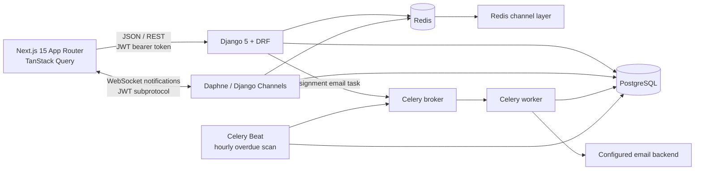

# Tasklane

Tasklane is a multi-tenant project and task management application built with Django REST Framework, PostgreSQL, Redis, Celery, Django Channels, and Next.js. The repository is organized as `backend/` and `frontend/`; Docker Compose runs the complete local stack.

## Architecture



The HTTP and WebSocket protocols are served by the ASGI application. The API uses PostgreSQL for durable domain data; Redis backs both Celery and the Channels event layer. The frontend is a Next.js App Router application with TypeScript, Tailwind CSS, and TanStack Query.

## Requirements and local setup

- Docker Desktop / Docker Engine with the Compose plugin
- Git

1. Create a local environment file and replace the example secrets:

   ```powershell
   Copy-Item .env.example .env
   ```

   `DJANGO_SECRET_KEY` is required and must contain at least 32 characters. Replace the example with a unique random value (50+ characters recommended), and set a strong PostgreSQL password. Do not commit `.env`.

2. Build and start all services in the background:

   ```powershell
   docker compose up --build -d
   ```

   Compose waits for PostgreSQL and Redis healthchecks before starting the API, Celery worker, or Beat. PostgreSQL health is checked with the configured `POSTGRES_USER` and `POSTGRES_DB`; Redis health is checked with `redis-cli ping`. The backend applies committed database migrations before starting the ASGI server.

   Check startup status with:

   ```powershell
   docker compose ps
   ```

   Wait until the database and Redis report `healthy` and the API, worker, Beat, and frontend report `running`.

3. Open:
   - Web app: <http://localhost:3000>
   - Interactive API reference (Swagger UI): <http://localhost:8000/api/docs/>
   - OpenAPI document: <http://localhost:8000/api/schema/>

Stop services with `docker compose down`. Database data is stored in the named `pgdata` volume and remains between restarts. To remove that data, explicitly run `docker compose down -v`.

### Environment configuration

`.env.example` documents the supported variables: PostgreSQL database/user/password/host, required `DJANGO_SECRET_KEY` (at least 32 characters), `DJANGO_DEBUG`, allowed hosts, Redis URL, JWT access/refresh lifetimes, email backend/from address, frontend URL, CORS origins, and the public frontend API URL. Local email defaults to Django's console backend. Use a real mail backend and tightly scoped host/CORS settings outside local development.

## Backend structure and API

Each domain app follows the same separation:

| App | Responsibility |
| --- | --- |
| `backend/apps/accounts/` | User model, registration, JWT endpoints, password changes and reset |
| `backend/apps/organizations/` | Organizations, memberships, roles, invitations and organization selectors |
| `backend/apps/projects/` | Project selectors, serializers and service-layer mutations |
| `backend/apps/tasks/` | Tasks, comments, activity history, selectors, services and Celery jobs |
| `backend/apps/notifications/` | JWT-authenticated WebSocket notifications and Redis channel-layer publishing |

Selectors own read/query behavior; services own business rules and writes; serializers define API input/output; views route requests and delegate. Authorization is centralized in `organizations.services.ensure_role` and `role_of`. Task activity is written in the task service layer rather than through model signals.

The REST API is rooted at `/api/`:

| Resource | Routes |
| --- | --- |
| Authentication | `/api/auth/register/`, `/login/`, `/refresh/`, `/logout/`, `/me/`, `/password/change/`, `/email/change/`, `/password/forgot/`, `/password/reset/` |
| Organizations | `/api/organizations/`, `/api/organizations/{id}/`, `/api/organizations/{id}/members/` (GET/POST), `/api/organizations/{id}/members/{member_id}/` (PATCH/DELETE), `/api/organizations/{id}/projects/` |
| Projects | `/api/projects/`, `/api/projects/{id}/` |
| Tasks | `/api/tasks/`, `/api/tasks/{id}/`, `/comments/`, `/activity/` |
| Comments | `/api/comments/{id}/` (edit/delete) |
| Dashboard/activity | `/api/dashboard/`, `/api/activity/` |

List endpoints support pagination and relevant search/order/filter options. Task filters can be combined, for example:

```text
GET /api/tasks/?status=TODO&priority=HIGH&assigned_to=42
```

Tasks can also be filtered by `project`; project lists support `status` and `organization`. Use `search` for configured text fields and `ordering` for fields allowed by that resource. List responses use page-number pagination with a default page size of 50.

### Authentication flow

- Registration and login accept JSON; login returns short-lived access and refresh JWTs.
- Protected HTTP requests send Authorization: Bearer <access-token>.
- Access tokens last 15 minutes by default; refresh tokens last 7 days by default. Both values are configurable.
- The frontend stores the tokens in browser `localStorage` and refreshes after a 401. Refresh rotation is enabled and the replaced refresh token is blacklisted.
- Logout blacklists the submitted refresh token. Password changes validate the new password with Django's configured validators, reject reusing the current password, blacklist all existing refresh tokens, and return a new token pair for the active session.
- Authenticated users can change their own password or email at `/api/auth/password/change/` and `/api/auth/email/change/`, regardless of organization role. Email changes require the current password, use case-insensitive uniqueness, and send a notice to the previous email address. `/api/auth/me/` only allows first-name edits.
- Login, register, refresh, logout, password change, email change, forgot-password, and reset-password endpoints use the `auth` throttle scope (10 requests/minute by default). Forgot-password responses do not reveal whether an email address exists.
- WebSocket authentication sends the access token as a `jwt.<token>` WebSocket subprotocol (alongside the `tasklane` protocol), not in the URL query string.

### Server vs Client Components

- Server route pages provide metadata and route shells: `frontend/app/(app)/dashboard/page.tsx`, `frontend/app/(app)/projects/[id]/page.tsx`, `frontend/app/(app)/tasks/[id]/page.tsx`, `frontend/app/(app)/settings/page.tsx`, `frontend/app/login/page.tsx`, and `frontend/app/register/page.tsx`.
- Interactive route components live beside their route pages: `frontend/app/(app)/dashboard/DashboardClient.tsx`, `frontend/app/(app)/projects/[id]/ProjectClient.tsx`, `frontend/app/(app)/tasks/[id]/TaskClient.tsx`, `frontend/app/(app)/settings/SettingsClient.tsx`, `frontend/app/login/LoginForm.tsx`, and `frontend/app/register/RegisterForm.tsx`.
- Interactive features stay client-side because authentication tokens are stored in `localStorage`, and the UI uses TanStack Query, browser APIs, forms, and drag-and-drop. Route pages do not fetch private API data on the server.
- Fetching private data in Server Components would require moving authentication tokens to secure `httpOnly` cookies. That is a documented future improvement; the current token storage and authentication model remain unchanged.
- The `(app)` route group has shared `loading.tsx`, client `error.tsx`, and `not-found.tsx` boundaries; dashboard, project, and task routes retain their more specific loading fallbacks.

### Tenant isolation and permissions

Every list and detail selector scopes results through the authenticated user's organization membership. A resource outside that scope is not exposed by detail endpoints. `X-Organization-ID` is an optional context/filter header; it can narrow a membership-scoped result but never grants access. Mutations derive the organization from the database-backed project/task or validate organization membership and role before writing.

Roles are ordered `OWNER > ADMIN > MEMBER > VIEWER`. Owners and admins manage projects and members; members can create tasks and update tasks they created or are assigned to; viewers are read-only. Deleting tasks requires admin-level permission. Comment authors can edit/delete their own comments; owners/admins can moderate deletion. Only an OWNER can grant or revoke ADMIN. ADMIN can manage MEMBER and VIEWER roles, but cannot manage OWNERs or other ADMINs. Nobody can change or remove their own membership, and OWNER memberships cannot be changed or removed. The frontend hides controls according to the current role, while the API independently enforces every permission.

### Organization invitations

Organization members are managed from the dashboard for the selected organization. OWNER and ADMIN can invite a registered account directly as MEMBER or VIEWER; only OWNER may invite or promote an ADMIN. An invitee who already has an account is added immediately. An unregistered email receives a seven-day pending invitation and a Celery-delivered registration link at `/register?invite=<token>`. Pending invitations are unique per organization and case-insensitive email.

Registration validates a supplied invitation token against the registering email. Registration without a token and successful login also accept active pending invitations for that email, so an invitee who opens the ordinary registration page or already has an account still joins the organization. Acceptance creates the membership with the invited role and marks the invitation used. Expired, unknown, email-mismatched, and already-used tokens are rejected. The resulting membership appears in that user's organization dropdown; role-based controls are hidden in the UI and remain protected by API authorization.

Member role changes and removals use `PATCH` and `DELETE` on `/api/organizations/{id}/members/{member_id}/`. These operations resolve the member inside the caller's organization, returning 404 for cross-organization IDs. The API schema documents their path IDs, JWT authentication, request body, success responses, and standard error envelope.

Errors use the shared response envelope:

```json
{
  "success": false,
  "error": {
    "code": "VALIDATION_ERROR",
    "message": "Validation failed.",
    "details": { "field": ["Reason"] }
  }
}
```

The details member is optional. Unexpected server errors use the same envelope and do not include stack traces. `/api/docs/` is generated from drf-spectacular and documents JWT auth, query/path/header parameters, request bodies, success responses, and the shared error envelope.

## Celery and real-time events

Assignment changes enqueue `send_assignment_email` through Celery after the database transaction commits. Celery Beat schedules the overdue-task scan hourly. Redis is the broker; workers and Beat are separate Compose services.

The Channels consumer is exposed at `/ws/notifications/?organization_id=<id>`. It validates the JWT and organization membership at connection time, sends organization events only to organization members, sends assignment notifications only to the assigned user, and rechecks membership/token expiry before delivering an event. Notifications cover task assignment, new comments, and status changes. The frontend notification navbar reconnects as the session or active organization changes.

## Tests, lint and formatting

Run backend checks in the Compose environment:

```powershell
docker compose exec backend pytest
docker compose exec backend ruff check .
docker compose exec backend black --check .
```

Run frontend checks locally from `frontend/` (Node.js 20 or newer):

```powershell
npm ci
npm test
npm run lint
npm run format
npm run build
```

Backend tests enforce a minimum 80% coverage threshold. `pytest.ini` supplies a test-only Django secret so tests can run without the local `.env`; it is never used by application startup. Frontend tests use Vitest, jsdom, and React Testing Library.

## Key technical decisions and scaling

- Explicit task services own activity writes and transactional side effects; this keeps actor/old-value context available and prevents hidden signal behavior.
- Tenant filtering is enforced in selectors, then write roles are checked in services. Client-supplied organization context is never an authorization grant.
- JWT refresh rotation and blacklist support provide revocation; auth endpoints are throttled.
- WebSocket credentials travel in a subprotocol rather than query parameters; Redis Channels supports multiple ASGI instances.
- PostgreSQL stores durable data; Redis is intentionally used for transient queues/events rather than domain records.
- To scale, run multiple stateless ASGI/API instances behind a proxy with WebSocket support, scale Celery workers separately from Beat (keep one Beat scheduler per environment), and use managed PostgreSQL/Redis with backups, monitoring, and connection limits. Configure trusted origins/hosts, TLS, secrets, email delivery, and database migrations as part of production operations.
- See [DATABASE_SCHEMA.md](./DATABASE_SCHEMA.md) for the ER diagram and rationale for explicit and uniqueness indexes.
